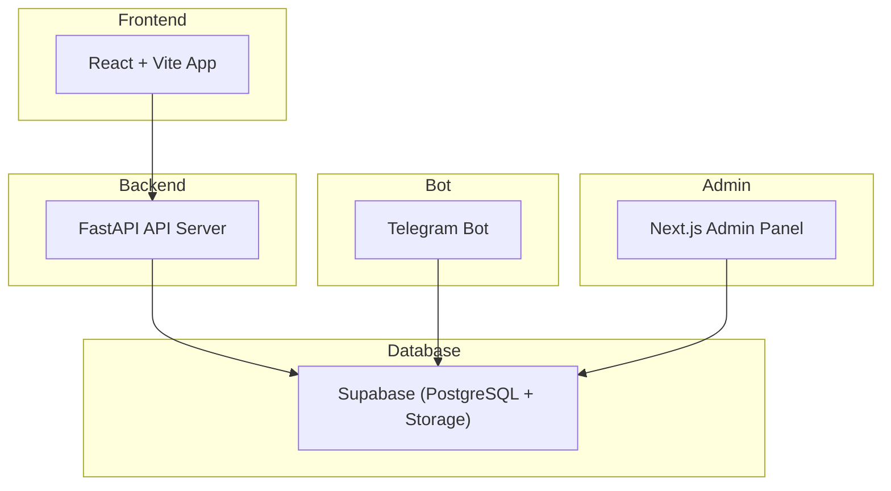

# NTUGuessr

**NTUGuessr 2025** – Entire codebase for a location-guessing game built with a full-stack architecture, including frontend, backend, Telegram bot, and an admin panel.

---

## 📌 Project Overview

NTUGuessr is an interactive game where players guess locations based on images and clues.  
The system consists of:

- **Frontend** – Player-facing React/Vite application.
- **Backend** – FastAPI service handling API requests and database operations.
- **Telegram Bot** – Allows players to submit images and geolocation data via Telegram.
- **Admin Panel** – Web interface for managing game data directly in Supabase.
- **Supabase** – Cloud-based PostgreSQL database and file storage.

---

## 🗂️ Repository Structure

## Repository Structure

```plaintext
NTUGuessr/
├── frontend/               # React + Vite main user interface
│   ├── src/                # Frontend source code
│   ├── public/             # Static assets
│   ├── package.json        # Frontend dependencies
│   ├── vite.config.js      # Vite configuration
│   └── .env
│
├── backend/                # FastAPI server
│   ├── requirements.txt    # Backend dependencies
│   ├── main.py             # FastAPI entry point
│   └── .env
│
├── telegram-bot/           # Telegram bot integration
│   ├── main.py             # Bot entry point
│   ├── requirements.txt    # Bot dependencies
│   └── .env
│
├── admin-panel/            # Next.js admin interface (no auth yet)
│   ├── pages/              # Page components
│   ├── public/             # Static assets
│   ├── package.json        # Admin panel dependencies
│   └── .env.local
│
│
├── .gitignore              # Root-level ignore rules
├── README.md               # Root project readme
└── LICENSE                 # Project license
```

---

## 🛠️ Setup Steps

1. **Setup Supabase**

   - Create a Supabase project.
   - Note down your `SUPABASE_URL` and `SERVICE_KEY`.
   - (Optional) Create `ANON_KEY` if needed for public access from the frontend/admin panel.

2. **Setup Backend**

   - See [Backend/README.md](Backend/README.md) for instructions.

3. **Setup Frontend**

   - See [Frontend/README.md](Frontend/README.md) for instructions.

4. **Setup Telegram Bot** (optional)

   - See [TeleBot/README.md](TeleBot/README.md) for instructions.

5. **Setup Admin Panel**
   - See [Admin_Panel/README.md](Admin_Panel/README.md) for instructions.
   - ⚠ **Note:** Currently no authentication is implemented — the panel interacts directly with Supabase without going through the backend. Future updates will include backend integration and admin role permissions.

---

## 🖥️ Architecture Overview



---

## 🚀 Future Plans

1. Backend integration for the Admin Panel.

2. Role-based authentication and access control.

3. Deployment using Docker and CI/CD pipelines.

4. Additional game features and UI improvements.
