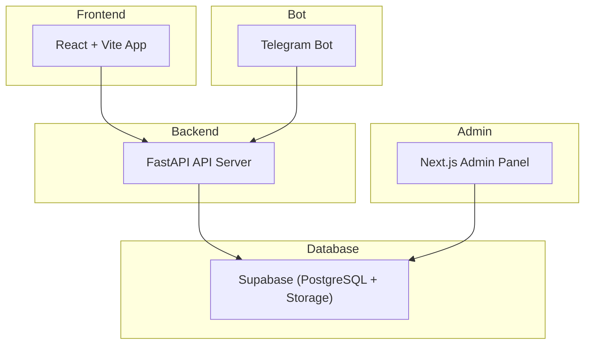

# NTUGuessr

**NTUGuessr 2025** – Entire codebase for a location-guessing game built with a full-stack architecture, including frontend, backend, Telegram bot, and an admin panel.

---

## 📌 Project Overview

NTUGuessr is an interactive game where players guess locations based on images and clues.  
The system consists of:

- **Frontend** – Player-facing React/Vite application.
- **Backend** – FastAPI service handling API requests and database operations.
- **Telegram Bot** – Allows players to submit images and geolocation data via Telegram.
- **Admin Panel** – Web interface for managing game data directly in Supabase.
- **Supabase** – Cloud-based PostgreSQL database and file storage.

---

## 🗂️ Repository Structure

## Repository Structure

```plaintext
NTUGuessr/
├── frontend/               # React + Vite main user interface
│   ├── src/                # Frontend source code
│   ├── public/             # Static assets
│   ├── package.json        # Frontend dependencies
│   ├── vite.config.js      # Vite configuration
│   └── .env
│
├── backend/                # FastAPI server
│   ├── requirements.txt    # Backend dependencies
│   ├── main.py             # FastAPI entry point
│   └── .env
│
├── telegram-bot/           # Telegram bot integration
│   ├── main.py             # Bot entry point
│   ├── requirements.txt    # Bot dependencies
│   └── .env
│
├── admin-panel/            # Next.js admin interface (no auth yet)
│   ├── pages/              # Page components
│   ├── public/             # Static assets
│   ├── package.json        # Admin panel dependencies
│   └── .env.local
│
│
├── .gitignore              # Root-level ignore rules
├── README.md               # Root project readme
├── LICENSE                 # Project license
└── setup.py                # Auto env setup script
```

---

## 🛠️ Setup Steps

### 1. Create Supabase Account and Setup

- Create a Supabase project at [supabase.com](https://supabase.com).
- Note down your project credentials:
  - `SUPABASE_URL`
  - `ANON_KEY`

### 2. Create Required Tables

Run the following SQL commands in your Supabase SQL editor to create the necessary tables:

```sql
create table public.users (
  id uuid not null default gen_random_uuid (),
  username text null,
  password text null,
  clan text null,
  high_score numeric null default '0'::numeric,
  created_at timestamp with time zone not null default now(),
  "group" text null default 'player'::text,
  constraint users_pkey primary key (id)
) TABLESPACE pg_default;

create table public.need_approval (
  filename text not null,
  lat double precision null,
  lng double precision null,
  constraint need_approval_pkey primary key (filename)
) TABLESPACE pg_default;

create table public.locs (
  filename text not null,
  lat double precision null,
  lng double precision null,
  constraint locs_pkey primary key (filename)
) TABLESPACE pg_default;
```

### 3. Create Public Storage Bucket

Create a public storage bucket named locs in your Supabase dashboard:

1. Navigate to Storage.

2. Click Create new bucket.

3. Enter locs as the bucket name.

4. Enable Public access.

5. Save the bucket.

This bucket will store approved game images accessible by the frontend and bot.

### 4. Create Telegram Bot

1. Create a Telegram Bot using `@BotFather`

2. Note your Telegram Bot API key.

### 5. Automated Environment Setup

To simplify configuring the project, a setup.py script is provided to generate all necessary `.env` files by prompting you for required API keys and URLs.

How to use the setup script:

- Ensure you have Python 3 installed.

- Run the script from the project root:

```bash
python setup.py
```

Follow the interactive prompts to enter:

1. Supabase project URL and keys

2. Telegram Bot API key

3. Backend (FastAPI) URL (optional, can be manually added later)

The script will create `.env` or `.env.local` files in the appropriate subdirectories:

- Frontend/.env

- Backend/.env

- Admin_panel/.env.local

After the script completes, you can start each component as usual.

### 6. Further instructions for each part of the project are located at:

1.  [Backend/README.md](Backend/README.md)

2.  [Frontend/README.md](Frontend/README.md)

3.  [Admin_panel/README.md](Admin_panel/README.md)
    - ⚠ **Note:** Currently no authentication is implemented — the panel interacts directly with Supabase without going through the backend. Future updates will include backend integration and admin role permissions.

---

## 🖥️ Architecture Overview



---

## 🚀 Future Plans

1. Backend integration for the Admin Panel.

2. Role-based authentication and access control.

3. Deployment using Docker and CI/CD pipelines.

4. Additional game features and UI improvements.
